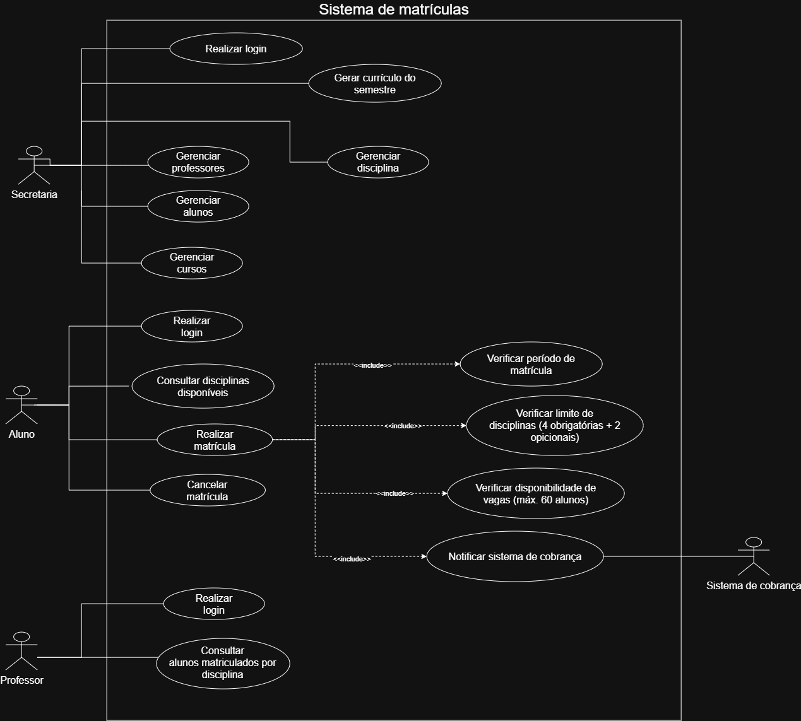
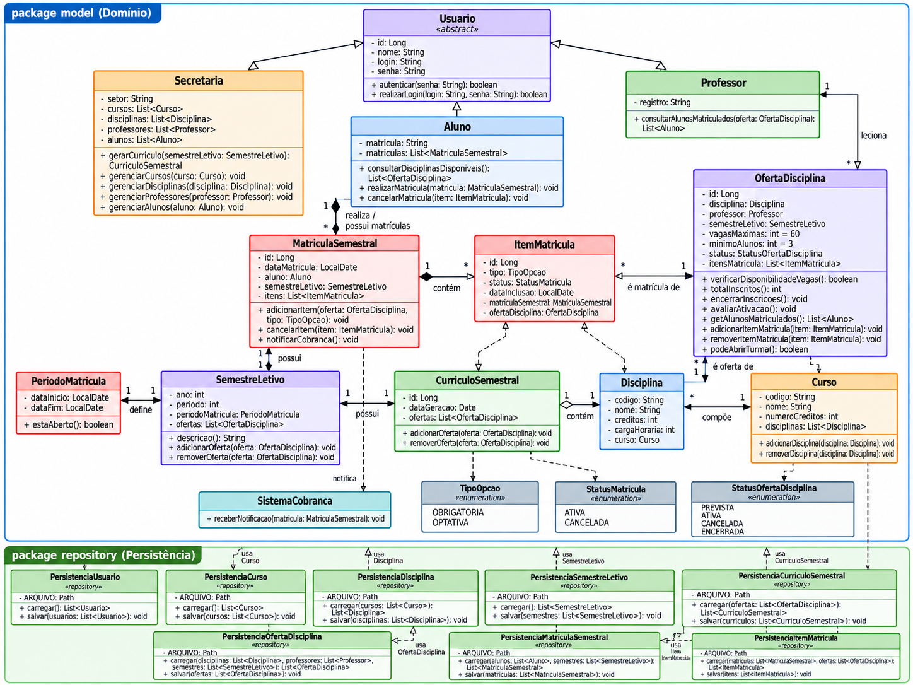

# 🎓 Sistema de Matrículas Universitárias
 
Sistema para informatizar o processo de matrículas de uma universidade: gestão de currículos, disciplinas e cursos pela secretaria, matrícula e cancelamento de disciplinas pelos alunos, e consulta de turmas pelos professores.
 
> 📚 Projeto desenvolvido para a disciplina **Laboratório de Desenvolvimento de Software** — PUC Minas, 4º período/2026
> 
> 👩‍🏫 Profa. Milena Menezes Adão
 
---
 
## 📌 Sumário

- [📖 Sobre](#-sobre)
- [🎯 Objetivo](#-objetivo)
- [👥 Atores](#-atores)
- [📝 Histórias de Usuário](#-histórias-de-usuário)
- [⚙️ Regras de Negócio](#️-regras-de-negócio)
- [🗺️ Diagrama de Caso de Uso](#️-diagrama-de-caso-de-uso)
- [🧩 Diagrama de Classes](#-diagrama-de-classes)
- [💾 Persistência de Dados](#-persistência-de-dados)
- [📁 Estrutura do Projeto](#-estrutura-do-projeto)
- [🛠️ Como executar](#️-como-executar)
- [🚀 Status do Projeto](#-status-do-projeto)
- [✍️ Autores](#️-autores)
---
 
## 📖 Sobre
 
O **Sistema de Matrículas Universitárias** foi idealizado para automatizar o processo de matrícula em disciplinas de uma universidade, hoje feito manualmente pela secretaria. Ele conecta três perfis de usuário: secretaria, aluno e professor, e se integra com o sistema de cobranças para notificar matrículas realizadas em cada semestre.
 
## 🎯 Objetivo
 
Fornecer uma solução centralizada que permita:
 
- ✅ Cadastrar cursos, disciplinas e professores
- ✅ Controlar períodos de matrícula por semestre
- ✅ Permitir que alunos se matriculem e cancelem disciplinas
- ✅ Aplicar regras de ativação e cancelamento de turmas conforme o número de alunos inscritos
- ✅ Notificar o sistema de cobranças a cada matrícula
- ✅ Permitir que professores consultem suas turmas
## 👥 Atores
 
| Ator | Descrição |
|---|---|
| 🏫 **Secretaria** | Cadastra cursos, disciplinas e professores; gera o currículo do semestre |
| 🎒 **Aluno** | Realiza login, matrícula e cancelamento de disciplinas |
| 👩‍🏫 **Professor** | Realiza login e consulta os alunos matriculados em suas disciplinas |
| 💰 **Sistema de Cobranças** *(externo)* | Recebe notificações para cobrar os alunos matriculados |
 
## 📁 Estrutura do Projeto

```text
src/main/java/br/com/sistemamatriculas/
├── model/        # Entidades e regras de domínio
├── enums/        # Enumerações utilizadas pelo sistema
├── repository/   # Persistência dos dados em arquivos
├── util/         # Utilitários da aplicação
└── Main.java     # Interface e fluxo principal pelo terminal
```
 
### 🏫 Secretaria
 
- Como secretaria, quero cadastrar um curso com nome e número de créditos, para que ele fique disponível no sistema.
- Como secretaria, quero cadastrar disciplinas vinculadas a um curso, para compor o currículo de cada semestre.
- Como secretaria, quero cadastrar professores no sistema, para vinculá-los às disciplinas que lecionam.
### 🎒 Aluno
 
- Como aluno, quero fazer login no sistema, para acessar minhas funcionalidades de matrícula.
- Como aluno, quero me matricular em até 4 disciplinas obrigatórias (1ª opção), para cumprir meu currículo do semestre.
- Como aluno, quero me matricular em até 2 disciplinas optativas (2ª opção), para complementar minha formação.
- Como aluno, quero cancelar uma matrícula feita anteriormente, dentro do período de matrículas, caso eu mude de ideia.
### 👩‍🏫 Professor
 
- Como professor, quero fazer login no sistema, para acessar minhas funcionalidades.
- Como professor, quero visualizar a lista de alunos matriculados em cada disciplina que leciono, para me preparar para o semestre.
### 💰 Sistema de Cobranças *(integração)*
 
- Como sistema de matrículas, quero notificar o sistema de cobranças sempre que um aluno se inscrever em disciplinas de um semestre, para que ele possa ser cobrado corretamente.
## ⚙️ Regras de Negócio
 
- 🔒 Uma disciplina só fica ativa no semestre seguinte se tiver **no mínimo 3 alunos** inscritos ao final do período de matrículas; caso contrário, é cancelada.
- 🚫 O número máximo de alunos por disciplina é **60**; ao atingir esse limite, as inscrições são encerradas automaticamente.
- 📩 Toda matrícula realizada dispara uma notificação ao sistema de cobranças.
- 🔑 Todos os usuários (aluno, professor, secretaria) possuem login e senha para acesso.

## 💾 Persistência de Dados

O sistema utiliza persistência local em arquivos `.txt`.

Os dados são armazenados na pasta `dados/`, criada automaticamente durante a execução da aplicação.

São persistidos dados referentes a:

- usuários;
- cursos;
- disciplinas;
- semestres letivos;
- ofertas de disciplinas;
- matrículas semestrais;
- itens de matrícula;
- currículos semestrais.

As classes responsáveis pelo acesso aos arquivos estão localizadas no pacote `repository`.

## 🗺️ Diagrama de Caso de Uso
 


## 🧩 Diagrama de Classes


 
## 🛠️ Como executar

### Pré-requisitos

Antes de executar o projeto, certifique-se de possuir instalado:

- Java JDK 17 ou superior;
- Apache Maven;
- Git.

### 1. Clone o repositório

```bash
git clone https://github.com/juliaszventura/sistema-matriculas-universidade.git
```

### 2. Acesse a pasta do projeto

```bash
cd sistema-matriculas-universidade
```

### 3. Compile o projeto

```bash
mvn clean compile
```

### 4. Execute a aplicação

```bash
java -cp target/classes br.com.sistemamatriculas.Main
```

A aplicação será executada diretamente pelo terminal, onde será possível criar uma conta e acessar as funcionalidades de acordo com o tipo de usuário:

- Aluno;
- Professor;
- Secretaria.

Os dados cadastrados durante a utilização do sistema são armazenados localmente em arquivos `.txt` na pasta `dados/`, criada automaticamente pela aplicação.
 
## 🚀 Status do Projeto
 
- [x] Lab01S01 — Diagrama de Caso de Uso + Histórias de Usuário
- [x] Lab01S02 — Diagrama de Classes + stub do projeto Java
- [x] Lab01S03 — Protótipo funcional (interface + persistência)

## ✍️ Autores
 
- Júlia de Souza Ventura
- Yuri Cardoso Viana

---
 
<p align="center">Desenvolvido para a disciplina de Laboratório de Desenvolvimento de Software — PUC Minas 💜</p>
 
